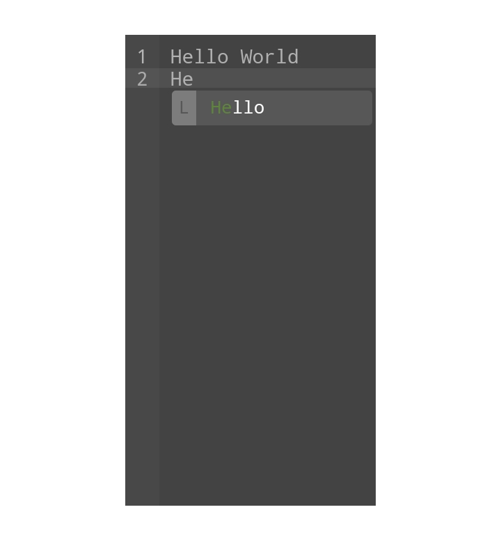
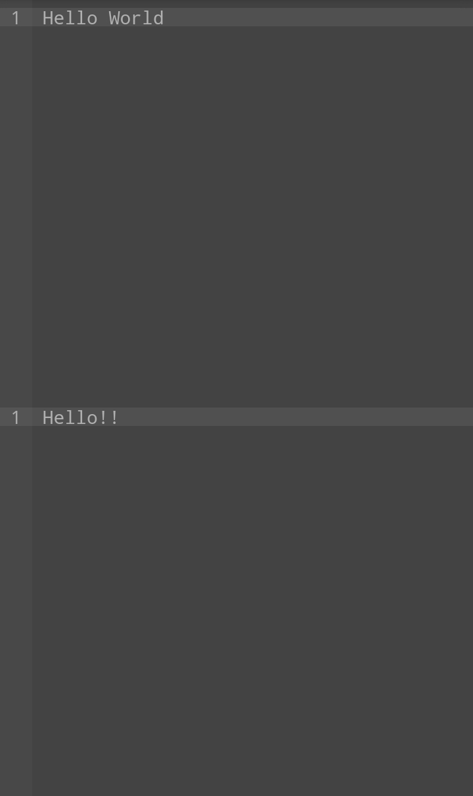

# DLEditor
Lightweight, minimal, responsive and mobile-friendly editor for Vanilla JavaScript.
(Inspired from Ace Editor)


| Responsive | Multiple editor support |
|:----------:|:-----------------------:|
| Any valid size is supported | You can use DLEditor multiple times |
|  |  |

```html
<link ref="stylesheet" href="dl-editor.css">
<style>
  * {
    padding: 0;
    margin: 0;
  }
  #editor {
    width: 100%;
    height: 100%;
  }
</style>
<body>
  <div id="editor"></div>
</body>
<script src="dl-editor.js"></script>
<script>
  var elem = document.getElementById("editor");
  var editor= new DLEditor(elem);
</script>
```

# Installation
```html
<link ref="stylesheet" href="https://cdn.jsdelivr.net/gh/dlvdls/DLEditor@main/dl-editor.css">
<script src="https://cdn.jsdelivr.net/gh/dlvdls/DLEditor@main/dl-editor.js"></script>
<!-- optional, for building modules (default syntax highlighter and snippets included) -->
<script src="https://cdn.jsdelivr.net/gh/dlvdls/DLEditor@main/dl-editor.builder.js"></script>
```

# Links

- [DLEditor methods](docs/DLEditor.md)
- [DLEditor's Events](docs/Event.md)
- [DLEditor's Instance](docs/Instance.md)

# Please Read
This editor is not recommended for heavy usage.
This library is indeed laggy to use.
