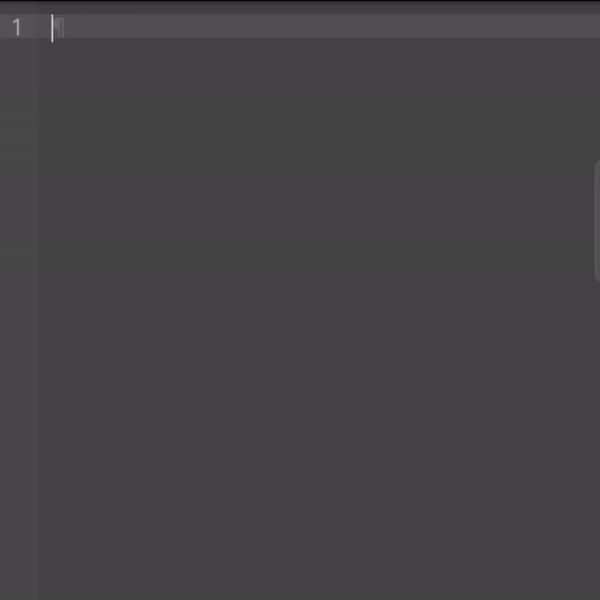

# Instance



## Save an instance
```js
editor.saveInstance(/* String : name of instance */);
// undefined
```

## Restore an instance
```js
editor.restoreInstance(/* String : name of instance */);
// undefined
```

## What is an instance
With instance, you can manage many resources in one editor.
Instance is basically an object containing the editor's current `value`, `start position`, `end position`, `theme`, `keybindings`, `syntax highlighter`, and `snippets`.
You can save it and restore it later but saving it will set the editor's value, keybindings, theme, syntax highlighter, and snippets to the default value (null).

# Instance of DLEditor V.S. Instance of DLEditor's Instance

## Instance of DLEditor
Instance of DLEditor is the actual instance (class DLEditor).
It's basically a class instance.
Multiple Instance of DLEditor is a multiple editor.

## Instance of DLEditor's Instance
While Instance of DLEditor's Instance is the object of the editor's current resources (DLEditor.).
It's an object in a class instance.
Multiple Instance of DLEditor's Instance is a multiple values.
