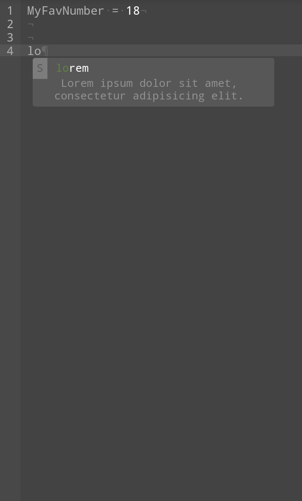

# Snippets



```js
editor.applySnippet("default");
// Note: the syntax highlighter
// module "default" is only defined
// when builder script is included.
```

# Labels
Every query have labels at the left.
`S` for **Snippet** which is defined by the current snippets module.
`L` for **Local** and created with the editor value. If you don't see any local queries, your current snippet module might disabled it.

Snippets are defined queries for tab, they can also control whether local query should include or not.

# Building your snippets module

```js
myModule = DLEditor.SnippetsBuilder(/* String : name of module */);
```

## Set allowLocal
If you don't want to allow local tokens to appear on the tab, you can disable it.
```js
myModule.setAllowLocal(/* Boolean */);
```

## Get allowLocal
```js
myModule.getAllowLocal();
// Boolean
```

## Add an item

**Info** and **alternative text** are optional.

### Regular
```js
myModule.addItem(/* String : query */);
```

### With information
```js
myModule.addItem(/* String : query, String : info */);
```

### Different value
If you have a big value to add in your snippet, you can use alternative text which change the displayed text.

```js
myModule.addItem(/* String : query, String : info, String : alternative text */);
```

Example:
```js
myModule.addItem("console.log", "Log a value to the console", "log");
```

When you type `log`, that item will appear and when you click it, instead of `log`, the value will be `console.log`.
