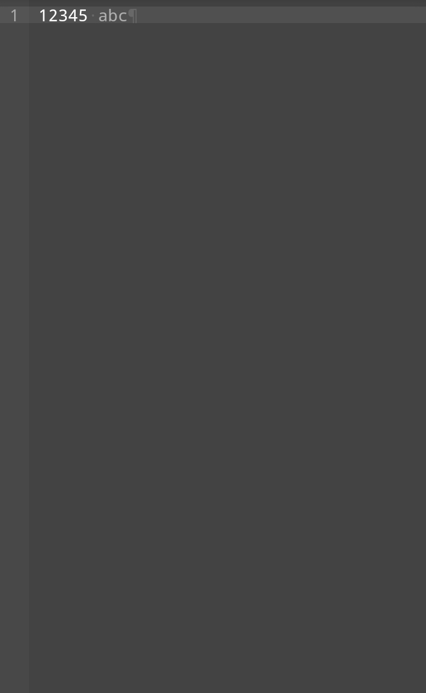

# Syntax Highlighter
Syntax Highlighter is a module to color texts.



```js
editor.applySyntaxHighlighter("default");
// Note: the syntax highlighter
// module "default" is only defined
// when builder script is included.
```

# Building your syntax highlighter module
```js
// Note: read the article 
var myModule = new DLEditor.SyntaxHighlighterBuilder(/* String : module name */);
```

## Initalize Handler

Initialize handler is called before processing editor's value lines.


### Set the initialize handler
```js
myModule.setInitHandler(function(editorValue) {
  // ...
});
```

### Get the initialize handler
```js
myModule.getInitHandler();
// Function
```

### Remove the initialize handler
```js
myModule.removeInitHandler();
```

## Process Handler

Process handler is called repeatedly (acts as forEach of editor value lines).
The handler must return a string.

### Set the process handler
```js
myModule.setProcessHandler(function(line) {
  // ...
});
```

### Get the process handler
```js
myModule.getProcessHandler();
// Function
```

### Remove the process handler
```js
myModule.removeProcessHandler();
```

## Finalize Handler

Finalize Handler is called after the initialize and process handler.
It is called with the argument array strings.
That argument is the processed lines.

### Set the finalize handler
```js
myModule.setFinalizeHandler(function(lines) {
  // ...
});
```

### Get the finalize handler
```js
myModule.getFinalizeHandler();
// Function
```

### Remove the finalize handler
```js
myModule.removeFinalizeHandler();
```

## Avoiding common issue
There is an issue where texts can be displayed wrong.
Example, I have a function here that colors special characters.

```js
myModule.setInitHandler(function(raw) {
return raw.replace(/([^a-z0-9\s\n\t]+)/gi, `<span style="color:gray">$1</span>`);
});
```

The issue is even entities are colored which makes the entity useless.
```html
<span style="color:gray">&</span>nbsp<span style="color:gray">;</span>
```

The result will be `&nbsp;` and not the actual entity character.

Before highlighting the value, DLEditor escapes these characters:
|Raw|`<`|`>`|`\s`|`\n`|
|:-:|:-:|:-:|:--:|:--:|
|**Escaped**|`&lt;`|`&gt;`|`&nbsp;`|`<br>`|

### Why not highlight first before replace?
If we highlight before, the span `<span style="color:gray">$1</span>` will be:

```html
&lt;span&nbsp;style="color:gray"&gt;$1&lt;/span&gt;
```

And it will act as a value and not as a colored text.

### Why replace?
Not escaping dangerous special characters (such as greater than or less than) will cause a bug
If i write this to the editor:

```html
<script>alert(1);</script>
```

It's not actually displaying but to execute it since the `pre` in your editor is using `innerHTML` and not `innerText` so coloring texts is possible.

## Exporting your module
Take a look at [Exporting Modules](#) for more information.
